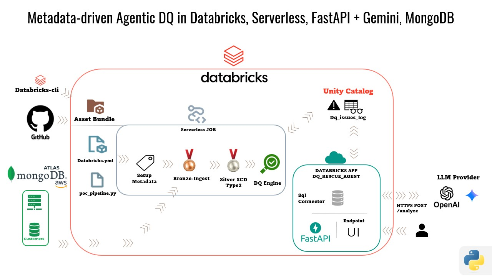

## Agentic Data Quality POC (Databricks Free Edition)

Minimal metadata-driven pipeline with SCD Type 2 and data quality checks, implemented in Python for Databricks Serverless.

### Architecture

- Source: MongoDB Atlas collection `ecommerce.customers`
- Bronze: `workspace.agentic_poc.bronze_customers`
- Silver (SCD2): `workspace.agentic_poc.silver_customers`
- Rules: `workspace.agentic_poc.dq_rules`
- Issues log: `workspace.agentic_poc.dq_issues_log`
- Workflow stages:
  - `SetupMetadata`
  - `IngestBronze`
  - `Scd2Silver`
  - `DqEngine`
- App: FastAPI service (`app/agent_app.py`) that reads latest DQ issue and generates remediation guidance with LLM.



### Repository Layout

- `databricks.yml`: Databricks Asset Bundle definition (job + app).
- `pipeline/poc_pipeline.py`: End-to-end PySpark pipeline (all workflow stages).
- `scripts/00_mongo_simulator.py`: Seed/incremental test data generator for MongoDB.
- `app/agent_app.py`: API for issue retrieval and analysis.
- `app/requirements.txt`: App dependencies.
- `.load-env.ps1`: Loads `.env` keys as `BUNDLE_VAR_*` process variables.

### Prerequisites

- Python 3.12+
- Databricks CLI (authenticated to your workspace)
- Databricks Free Edition workspace
- MongoDB Atlas URI
- Databricks SQL Warehouse (for the app query path)

### Environment

1. Copy template:
   - `Copy-Item .env.example .env`
2. Fill required values in `.env`.
   - `DQ_FAIL_ON_ISSUES=false` for warn mode
   - `DQ_FAIL_ON_ISSUES=true` for strict mode
3. Load variables in PowerShell:
   - `. .\.load-env.ps1`

### Deploy and Run

1. Validate bundle:
   - `databricks bundle validate -t dev`
2. Select DQ mode for deployment:
   - Warn mode (default): `$env:BUNDLE_VAR_dq_fail_on_issues="false"`
   - Strict mode: `$env:BUNDLE_VAR_dq_fail_on_issues="true"`
3. Deploy:
   - `databricks bundle deploy -t dev`
4. Seed base data:
   - `python scripts/00_mongo_simulator.py --mode reset_and_seed --mongo-uri "$env:MONGODB_URI"`
5. Run pipeline:
   - `databricks bundle run -t dev poc_pipeline_job`
6. Start app:
   - `databricks bundle run -t dev dq_rescue_agent`

### Incremental Test Cycle

- Good records:
  - `python scripts/00_mongo_simulator.py --mode add_good --mongo-uri "$env:MONGODB_URI"`
- Bad records:
  - `python scripts/00_mongo_simulator.py --mode add_bad --mongo-uri "$env:MONGODB_URI"`
- Re-run workflow:
  - `databricks bundle run -t dev poc_pipeline_job`

### Notes for Free Edition

- Use catalog `workspace` (not `main`).
- Pipeline is Python-based (`spark_python_task`) to stay compatible with Free Edition serverless runtime.

### DQ Task Behavior

`DqEngine` always writes issues to `workspace.agentic_poc.dq_issues_log`.

- Warn mode (`dq_fail_on_issues=false`): task completes successfully after logging issues.
- Strict mode (`dq_fail_on_issues=true`): task fails the job after logging issues.
- In strict mode, `DqEngine` failure with `[DQ_VALIDATION_FAILED]` indicates a business data quality failure, not a platform/system outage.

This setting is resolved on bundle deploy, so deploy again after changing it.

### AI Agent App

The project includes `dq_rescue_agent` (`app/agent_app.py`), a FastAPI service that reads DQ issues
from `workspace.agentic_poc.dq_issues_log`, builds an aggregated summary, and asks an LLM for concise
root-cause and remediation guidance.

- Supported providers:
  - `gemini`
  - `openai`
  - `anthropic`
- Provider selection:
  - `LLM_PROVIDER` in `.env`
- Required provider key:
  - `GEMINI_API_KEY` or `OPENAI_API_KEY` or `ANTHROPIC_API_KEY`

Main endpoints:

- `GET /`
- `GET /ui`
- `GET /health`
- `GET /latest-issue`
- `GET /issues-summary`
- `POST /analyze`
- `GET /docs`

UI behavior:

- `GET /` redirects to `/ui`.
- `/ui` is a user-friendly interface that calls `/latest-issue` and `/analyze`.
- `/docs` remains available for raw API testing.

Default analyze behavior:

- Looks at recent issues (default `window_hours=24`, `max_issues=200`).
- Aggregates failures by rule and affected records.
- Requests concise output with minimal code snippets.
- Supports `analysis_mode`:
  - `summary` (default): aggregate view across recent issues.
  - `latest`: single latest issue focus.

Example analyze request:

```powershell
Invoke-RestMethod -Method Post `
  -Uri "https://<your-app-url>/analyze" `
  -ContentType "application/json" `
  -Body '{"analysis_mode":"summary","additional_context":"Run after add_bad","window_hours":24,"max_issues":200,"sample_size":3,"concise":true}'
```

Example summary request:

```powershell
Invoke-RestMethod -Method Get `
  -Uri "https://<your-app-url>/issues-summary?window_hours=24&max_issues=200&sample_size=3"
```
